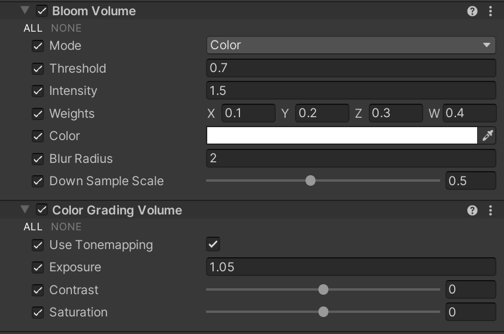
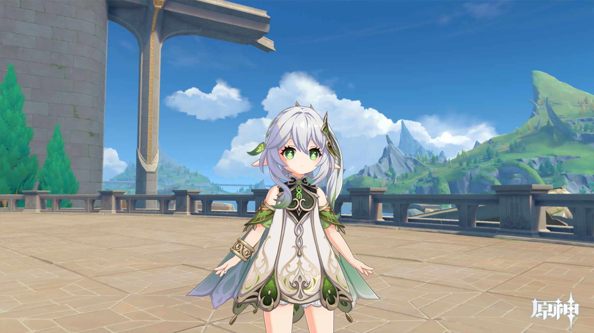
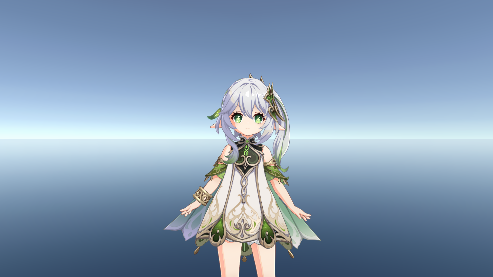

# UnityGenshinPostProcessing
A genshin-like post processing render feature, based on URP.

基于 URP 的仿原神渲染后处理流程

## Requirements

Unity Version: 2022.3

URP Version: 14.0.9

## Supported Features

- **Bloom**
- **Color Grading**, Exposure / Contrast / Saturation
- **Tone Mapping**

## Parameters

## References

[UnityGenshinToonShader](https://github.com/kaze-mio/UnityGenshinToonShader)

[NahidaRenderProject](https://github.com/kaze-mio/NahidaRenderProject)

## Render Examples

without post-processing:

with post-processing:

